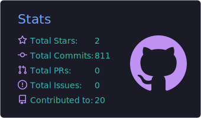
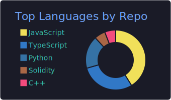
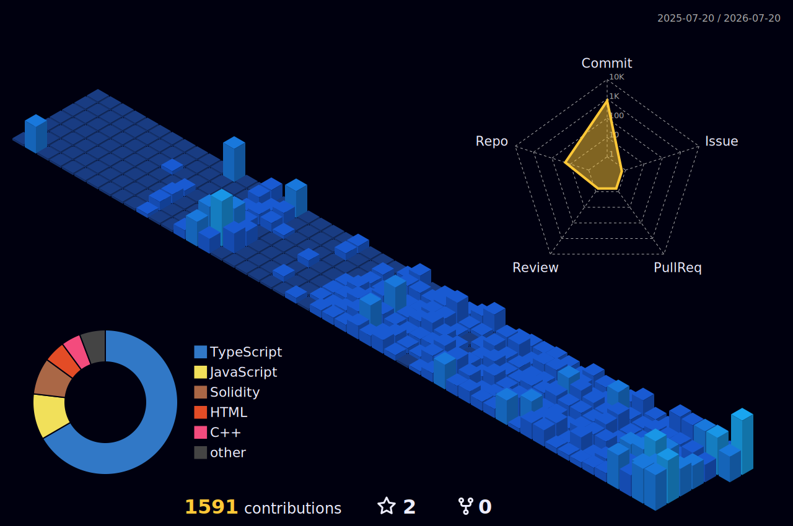

<!-- hero -->

<!-- contribution snake — regenerated daily on the `output` branch -->
<picture>
  <source media="(prefers-color-scheme: dark)" srcset="https://raw.githubusercontent.com/rkhooda/rkhooda/output/snake-dark.svg" />
  
</picture>

  

  

  
  
  <!-- portfolio — uncomment and drop the URL in:
  
  -->

<h2>in flow state</h2>

<h2>toolbox</h2>

  
  
  
  

<h2>by the numbers</h2>

<h2>the skyline</h2>

<h2>trophy shelf</h2>

  

<i>thanks for scrolling — keep vibing ♪</i>

  

