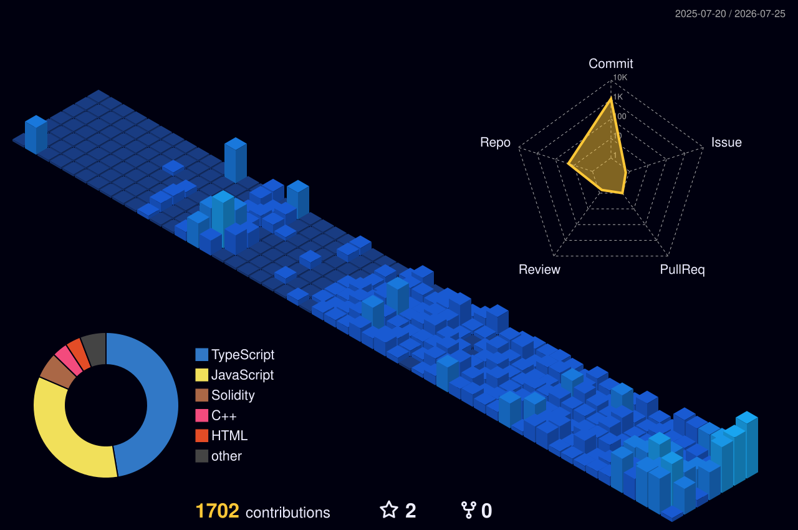

<!-- hero — repainted through the day by .github/workflows/profile.yml -->

  

<!-- drawn from my real contribution data. Pinned via the ANIM repository
     variable; clear that variable and it rotates through all seven daily. -->

  

  

  
  
  <!-- portfolio — uncomment and drop the URL in:
  
  -->

## currently building

<!-- building:start -->
- **[FlowPane](https://github.com/rkhooda/FlowPane)** `JavaScript` — Add video creation summary and ignore video source files · _9d ago_
- **[Portfolio](https://github.com/rkhooda/Portfolio)** `JavaScript` — guestbook: add word filter blocklist · _13d ago_
- **[Clixo](https://github.com/rkhooda/Clixo)** `TypeScript` — feat(home): complete home page with trust signals, use cases, FAQ, fi… · _13d ago_
- **[verified-digest](https://github.com/rkhooda/verified-digest)** `Python` — docs: rename project to verified-digest · _17d ago_
- **[Multiagent-builder](https://github.com/rkhooda/Multiagent-builder)** `Python` — docs: record the journey rung and correct the egress premise · _18d ago_
<!-- building:end -->

<h2>last 7 days</h2>

<h2>in flow state</h2>

<h2>toolbox</h2>

  
  
  
  

<h2>the skyline</h2>

<h2>guestbook</h2>

leave a comment and your avatar joins the wall — nothing you type is shown

<!-- guestbook-link:start -->

<!-- guestbook-link:end -->

  

<i>thanks for scrolling — keep vibing ♪</i>

  

