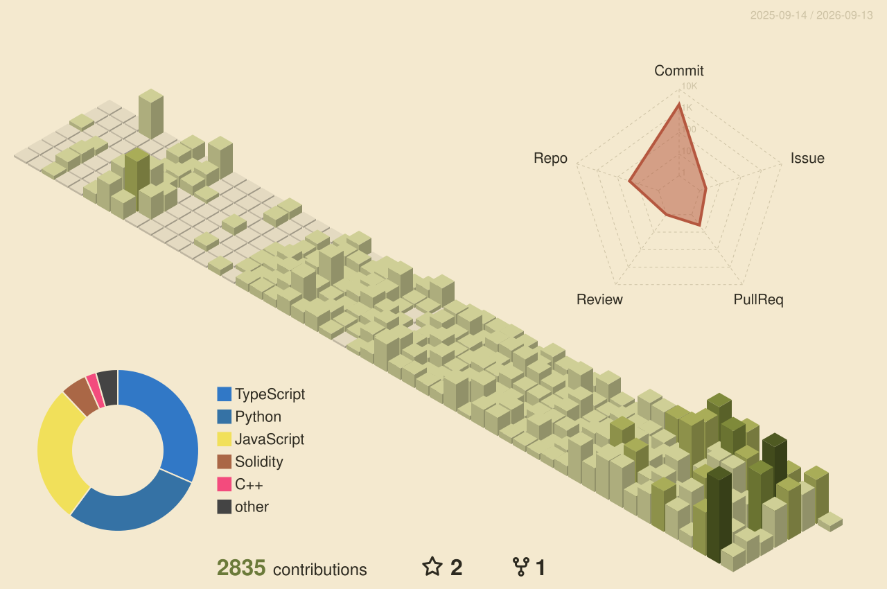

<!-- hero — repainted through the day by .github/workflows/profile.yml -->
<picture>
  <source media="(prefers-color-scheme: dark)" srcset="assets/hero-now-dark.svg?v=mtu9zyik">
  
</picture>

  

<!-- drawn from my real contribution data. Pinned via the ANIM repository
     variable; clear that variable and it rotates through all eight daily. -->
<picture>
  <source media="(prefers-color-scheme: dark)" srcset="assets/anim/today-dark.svg?v=mtu9zyik">
  
</picture>

  

<picture>
  <source media="(prefers-color-scheme: dark)" srcset="assets/streak-dark.svg?v=mtu9zyik">
  
</picture>

  

<picture>
  <source media="(prefers-color-scheme: dark)" srcset="https://readme-typing-svg.demolab.com?font=Fira+Code&weight=600&size=22&duration=3200&pause=900&color=A3B1C2&center=true&vCenter=true&width=800&height=48&lines=Full-stack+developer+chasing+good+ideas+and+good+music.;JACK+OF+TOO+MANY+TRADES;TypeScript+%C2%B7+React+%C2%B7+Node+%C2%B7+Python+%C2%B7+Unity;always+building+%C2%B7+always+vibing+%F0%9F%8E%A7">
  
</picture>

  <a href="https://www.linkedin.com/in/rakshit-hooda/">
    <picture>
      <source media="(prefers-color-scheme: dark)" srcset="https://img.shields.io/badge/LinkedIn-Rakshit_Hooda-8fa3b8?style=for-the-badge&logo=linkedin&logoColor=ffffff&labelColor=1f1e23">
      
    </picture>
  </a>
  <a href="mailto:rakshit.official703@gmail.com">
    <picture>
      <source media="(prefers-color-scheme: dark)" srcset="https://img.shields.io/badge/Email-say_hi-d8907c?style=for-the-badge&logo=gmail&logoColor=ffffff&labelColor=1f1e23">
      
    </picture>
  </a>
  <!-- portfolio — uncomment and drop the URL in:
  <a href="YOUR_PORTFOLIO_URL">
    <picture>
      <source media="(prefers-color-scheme: dark)" srcset="https://img.shields.io/badge/Portfolio-visit-b09cb8?style=for-the-badge&logo=googlechrome&logoColor=ffffff&labelColor=1f1e23">
      
    </picture>
  </a>
  -->

## currently building

<!-- building:start -->
- **[CredVault](https://github.com/rkhooda/CredVault)** `Solidity` — docs: how to authorise another issuer wallet · _20m ago_
- **[DSA](https://github.com/rkhooda/DSA)** `C++` — Time: 0 ms (100.00%)  Memory: 95.1 MB (60.97%) - LeetSync · _9h ago_
- **[TraceFall](https://github.com/rkhooda/TraceFall)** `Python` — docs: record the window change, the new endpoints and the demo-rot gu… · _20h ago_
- **[VectorFlow](https://github.com/rkhooda/VectorFlow)** `Python` — chore: ignore generated dataset readmes and wheel cache, add pipeline… · _21h ago_
- **[music-app](https://github.com/rkhooda/music-app)** `TypeScript` — chore(android): drop the RECORD_AUDIO permission · _22h ago_
<!-- building:end -->

<h2>in flow state</h2>

<h2>toolbox</h2>

<picture>
  <source media="(prefers-color-scheme: dark)" srcset="https://skillicons.dev/icons?i=ts,react,nodejs,express,py,postgres,prisma,docker,linux,unity,git,figma&theme=dark&perline=6">
  
</picture>

  <picture>
    <source media="(prefers-color-scheme: dark)" srcset="https://img.shields.io/badge/React_Native-1f1e23?style=for-the-badge&logo=react&logoColor=61DAFB">
    
  </picture>
  <picture>
    <source media="(prefers-color-scheme: dark)" srcset="https://img.shields.io/badge/Expo-1f1e23?style=for-the-badge&logo=expo&logoColor=white">
    
  </picture>
  <picture>
    <source media="(prefers-color-scheme: dark)" srcset="https://img.shields.io/badge/IPFS-1f1e23?style=for-the-badge&logo=ipfs&logoColor=65C2CB">
    
  </picture>
  <picture>
    <source media="(prefers-color-scheme: dark)" srcset="https://img.shields.io/badge/OpenAI-1f1e23?style=for-the-badge&logo=openai&logoColor=white">
    
  </picture>

<h2>the skyline</h2>

<picture>
  <source media="(prefers-color-scheme: dark)" srcset="profile-3d-contrib/profile-dark.svg">
  
</picture>

  

<i>thanks for scrolling — keep vibing ♪</i>

  

